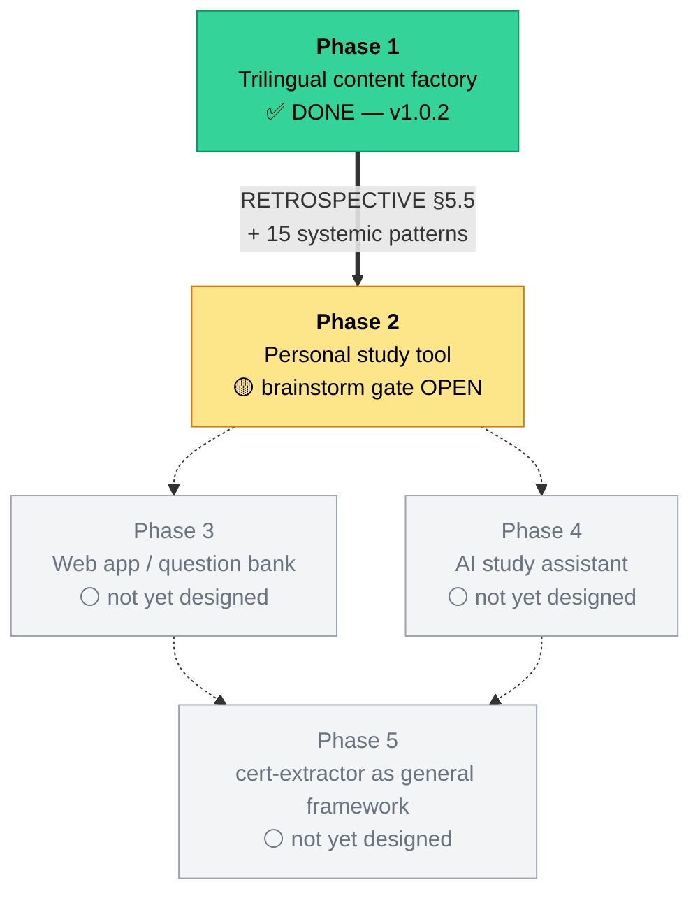

<div align="center">

# IT Passport — Trilingual Learning Content + `cert-extractor`

### Phase 1 — Shipped. Audited. Published.

*A single Japanese IT パスポート (令和 6 年度) textbook → a structured, trilingual **JP / ZH / EN** study dataset, produced by a pluggable `cert-extractor` pipeline.*

[](docs/STATE.md)
[](https://github.com/hakupao/it-passport-learning/releases/tag/itpassport-r6-v1.0.2)
[](RETROSPECTIVE.md#9-post-publication-validation-addendum)

[](https://www.python.org/)
[](https://github.com/astral-sh/uv)
[](packages/extractor/tests)
[](docs/decisions/)
[](RETROSPECTIVE.md#0-元数据--metadata)
[](RETROSPECTIVE.md#0-元数据--metadata)
[](#license)

🇬🇧 **English** &nbsp;·&nbsp; [🇨🇳 中文版 README](README.zh-CN.md)

</div>

---

## Phase 1 — what just happened

**11 days. 23 sessions. 82 locked decisions. One pipeline. One trilingual dataset. Two GitHub Releases.**

`cert-extractor` ingests a Japanese certification textbook and emits a structured `{jp, zh, en}` study dataset — every chapter, term, table, and practice question carries trilingual renderings, plus a `kana_helper` annotation on every katakana-only IT term so non-native readers map kana → concept in one glance. **That's the whole reason this exists.**

Phase 1 ships:

- **`cert-extractor`** — an 8-stage Mistral-OCR + Claude-LLM pipeline, cert-agnostic by design (D-010), with a 4-axis plugin architecture (D-021).
- **`itpassport-r6-v1.0.0`** (original) and **`itpassport-r6-v1.0.2`** (post-publication corrections) — two GitHub Releases of the trilingual dataset for the IT パスポート 令和 6 年度 textbook.
- **A full Tier-3 paper trail** — 82 ADRs, 23 session logs, 12 failure archives, 5 gate checkpoints, a 351-line retrospective, and a 100 %-coverage post-publication validation chain across **~80 agents in 9 subagent types**.

---

## Phase 1 highlights

| | |
|---|---|
| 📚 **Trilingual dataset** | 554 pages · 2 224 entities · **6 059 trilingual leaves** · 908-term glossary |
| 🈁 **`kana_helper` everywhere** | Every katakana-only IT term carries `{surface, reading, zh_concept}` — kana → concept in one glance |
| 🧩 **Cert-agnostic pipeline** | 4 pluggable axes (source / OCR / translator / exporter); onboard any cert via `pipelines/<cert_id>.yaml` |
| 🛡 **Dual-gate audit** | Deterministic detectors **+** LLM reviewer (D-077) **+** Stage 7 export envelope (D-078) — refuses untranslated / illegal-sentinel leaves |
| 💸 **Quasi-zero billed cost** | **$0.58 Mistral · $0 Anthropic** (max-plan OAuth, D-069) for the whole 579-page run |
| 🔬 **100 % post-pub validation** | Iter-3..8 audited **all 554 pages** via parallel scientist agents → ~736 corrections shipped as v1.0.2, **$0 LLM billed** |
| 🧪 **Test-first** | 492 unit + integration tests; ruff clean; `_fixtures/` underscore-prefixed (D-043) to keep pytest collection honest |
| 📜 **Tier-3 traceability** | 82 ADRs · 23 session logs · 12 failure archives · 5 gate checkpoints · FINAL `RETROSPECTIVE.md` (D-033) |

---

## Choose your path

### 🎓 I'm here to **learn** the IT Passport exam

Go straight to **[Releases](https://github.com/hakupao/it-passport-learning/releases)** and grab the latest trilingual bundle.

| What | Where |
|---|---|
| **Latest content** | [`itpassport-r6-v1.0.2`](https://github.com/hakupao/it-passport-learning/releases/tag/itpassport-r6-v1.0.2) — 554 pages, 2 224 entities, 6 059 trilingual leaves, 908-term glossary, ~736 post-pub corrections |
| Original | [`itpassport-r6-v1.0.0`](https://github.com/hakupao/it-passport-learning/releases/tag/itpassport-r6-v1.0.0) — kept immutable |
| How to read | `index.json` → `pages/page_NNN.json` (or `.md`) → `glossary.json` — see `output/README.md` inside the zip |

Every term carries a `{jp, zh, en}` triple. Every katakana-only IT term carries a `kana_helper = {surface, reading, zh_concept}` so non-native readers map kana → concept in one glance.

### 💻 I'm a **developer** and want to use `cert-extractor`

`cert-extractor` is cert-agnostic by design (D-010) — the same pipeline is meant to onboard any cert.

- Tour: **[`packages/extractor/README.md`](packages/extractor/README.md)**
- Architecture: 4 pluggable axes (source / OCR / translator / exporter) per [D-021](docs/decisions/)
- Stages: 8 (unpack → OCR → classify → re-OCR → structure → glossary → translate → audit → export) per [D-008](docs/decisions/)

```bash
# clone, install, run tests
git clone https://github.com/hakupao/it-passport-learning
cd it-passport-learning
uv sync
uv run pytest packages/extractor/tests/
```

To onboard a new certification: drop the source EPUB/PDF into `.source/`, write `pipelines/<cert_id>.yaml`, and run the same `cert-extractor` CLI. Runtime data lands at `data/<cert_id>/runs/<run_id>/<stage>/`.

### 🔬 I'm a **researcher** / **future me** stepping into Phase 2

| First read | Why |
|---|---|
| **[`docs/STATE.md`](docs/STATE.md)** | Live state — what's locked, what's open, where to resume |
| [`RETROSPECTIVE.md`](RETROSPECTIVE.md) | Phase 1 retro, including §8 (iter-5+6) + §9 (iter-7+8) post-publication validation addenda |
| [`docs/decisions/`](docs/decisions/) | 82 locked ADRs (D-001 … D-082) — the project's institutional memory |
| [`validation/`](validation/) | The ~80-agent / 9-subagent-type / 100 %-coverage post-publication validation chain that took v1.0.0 → v1.0.2 |

Phase 2 brainstorm is the next user-triggered session — entry point listed in `STATE.md` §5 "下一会话".

---

## The pipeline that shipped it

```mermaid
flowchart LR
    SRC[📚 EPUB<br/>.source/] --> S0[0 · Unpack<br/>page_NNN.jpg]
    S0 --> S1[1 · OCR<br/><b>Mistral</b>]
    S1 --> S2[2 · Classify<br/>Claude Sonnet]
    S2 --> S3[3 · Re-OCR<br/>Claude Vision<br/><i>conditional</i>]
    S3 --> S4[4 · Structure<br/>Claude → entities]
    S4 --> S45[4.5 · Glossary<br/><b>lock before translate</b>]
    S45 --> S5[5 · Translate<br/>Claude · glossary-constrained]
    S5 --> S6[6 · Audit<br/>deterministic + LLM<br/>D-077 / D-079 gates]
    S6 --> S7[7 · Export<br/>JSON · MD · SQLite<br/>D-078 dual-gate envelope]
    S7 --> REL[🚀 GitHub Release<br/>D-046 / D-081]

    style SRC fill:#fff7ed,stroke:#fb923c,color:#000
    style S1 fill:#fef3c7,stroke:#f59e0b,color:#000
    style S5 fill:#fef3c7,stroke:#f59e0b,color:#000
    style S6 fill:#dcfce7,stroke:#16a34a,color:#000
    style S7 fill:#dcfce7,stroke:#16a34a,color:#000
    style REL fill:#dbeafe,stroke:#2563eb,color:#000
```



Every stage writes evidence under `evidence/<cert_id>/runs/<run_id>/`. Each gate (`gate_N_<ts>.json` per D-079) is a halt point with auto-checked criteria — the run cannot proceed silently past a verdict.

---

## Phase roadmap



| Phase | Status | Notes |
|---|---|---|
| **Phase 1 — Trilingual content factory** | ✅ DONE | `cert-extractor` shipped + v1.0.0 + v1.0.2 published. `RETROSPECTIVE.md` FINAL with §8/§9 addenda. |
| **Phase 2 — Personal study tool** | 🟡 brainstorm gate open | Entry = OQ-05 + RETROSPECTIVE §5.5 carry-forward + 15 systemic patterns from iter-5..8 |
| Phase 3 — Web app / question bank | ⚪ not yet designed | — |
| Phase 4 — AI study assistant | ⚪ not yet designed | — |
| Phase 5 — `cert-extractor` as general framework | ⚪ not yet designed | — |

---

## What this project is (the long version)

Non-native learners of Japanese-language technical exams are blocked by **kana / kanji recognition**, not by concepts. CPU, TCP/IP, ROI are already known. `アクセシビリティ → accessibility → 可访问性`, seen once, sticks.

So Phase 1 built **a pipeline (`cert-extractor`)** and **shipped a trilingual dataset** from one IT パスポート 令和 6 年度 textbook. Every chapter, term, table, and practice question carries `{jp, zh, en}` renderings with kana-helper annotations.

The source textbook is acknowledged as input only — its raw content is **not** redistributed (see [License](#license)).

---

## Repository tour

```
.
├── README.md / README.zh-CN.md      this file (D-082 v2 landing)
├── CLAUDE.md / AGENTS.md            session-tool context (D-049)
├── RETROSPECTIVE.md                 Phase 1 retro + §8/§9 addenda (Rule C)
├── pyproject.toml / uv.lock         uv workspace root (D-036/037/038)
├── .source/                         🟦 gitignored input artifacts (D-082) — EPUB lives here
├── packages/extractor/              🟢 the cert-extractor package — see its README
├── apps/                            reserved for Phase 3+ (D-038)
├── docs/                            📚 STATE / decisions (ADRs) / discussion / release-notes / templates
├── evidence/                        Rule-A audit evidence per run
├── failures/                        Rule-B failed-attempt archive
├── validation/                      post-publication deep validation chain (iter-3..8)
└── data/                            🟦 gitignored runtime data (D-050)
```

Each tracked subdir has its own `README.md` describing what lives there.

---

## Build provenance (Phase 1 numbers)

<details open>
<summary><strong>Headline metrics</strong></summary>

| Metric | Value |
|---|---|
| Pipeline run | `dry_run_2026-05-12T13-23-19` (canonical for both v1.0.0 + v1.0.2) |
| Source corpus | IT パスポート 令和 6 年度 — 579 source pages → 554 emitted |
| Output | **2 224 entities · 6 059 trilingual leaves · 908-term glossary** |
| Test suite | 492 unit + integration |
| Cost | **Mistral $0.58 billed** · Anthropic $0 billed (max-plan OAuth per D-069) |
| Anthropic shadow cost | $657.36 (visibility only, never billed) |
| Post-pub corrections (iter-3..8) | ~736 JSON edits + 46 MD regens · 38 fix IDs · **$0 LLM billed** |
| Rule-D subagent diversity | **9** types (code-reviewer · analyst · verifier · critic · scientist · tracer · executor · architect · qa-tester) |
| Sessions / wall-time | 23 sessions across 11 days · ~50 active hours |

</details>

<details>
<summary><strong>Tier-3 paper trail</strong></summary>

| Artifact | Count | Path |
|---|---|---|
| Locked ADRs | **82** (D-001 … D-082) | `docs/decisions/` |
| Session logs | 23 | `docs/discussion/YYYY-MM-DD-session-NN.md` |
| Failure archives (Rule B) | 12 `.md` + 8 product subdirs (~95 page snapshots) | `failures/` |
| Audit evidence (Rule A) | 13 `.md` + multiple JSON checkpoints | `evidence/` |
| Gate checkpoints (D-079) | 5 | `evidence/.../gate_N_<ts>.json` |
| Phase retrospective (Rule C) | 1 (FINAL, 351 lines, §8/§9 addenda) | `RETROSPECTIVE.md` |
| Open OQs carried to Phase 2 | 3 (OQ-01 / OQ-02 / OQ-05) | `docs/STATE.md` §4 |

</details>

<details>
<summary><strong>4-axis plugin matrix</strong></summary>

| Axis | v1 built-in | Reserved for v2+ |
|---|---|---|
| Source reader | `epub_image` | `pdf` · `txt` · `html` · `docx` · `markdown` |
| OCR engine | `mistral` | `claude_vision` · `paddle` · `olmocr` · `tesseract` |
| Translator | `claude_sonnet_46` | `gpt` · `gemini` · `deepl` |
| Exporter | `json` · `markdown` · `sqlite` | `anki` · `notion` · `csv` |

</details>

---

## License

- **Code, pipeline, ADRs, release artifacts** — License: pending (will be a permissive OSS license; consult repo owner before redistribution).
- **Source textbook** — Not redistributed. Title and author intentionally omitted from artifacts (per the project's privacy convention 2026-05-17). You must legally acquire the EPUB separately and place it at `.source/IT-Passport.epub` if you want to re-run the pipeline.
- **Generated trilingual content** — Released under the GitHub Release; same redistribution caveats apply (derived from copyrighted source, intended for personal-study use and as a methodology demonstration).

---

## Getting in touch / contributing

This is a personal Tier-3 R&D project. Issues + PRs welcome but expect a slow-pace D-019 review cadence. Read [`docs/STATE.md`](docs/STATE.md) and the most recent session log before opening anything substantive.

<p align="right"><a href="#it-passport--trilingual-learning-content--cert-extractor">↑ back to top</a></p>
