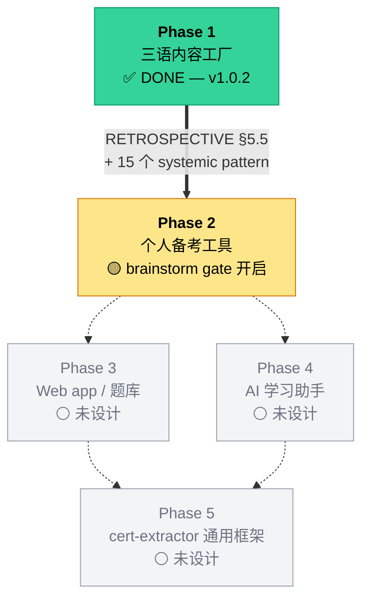

<div align="center">

# IT Passport — 三语学习内容 + `cert-extractor`

### Phase 1 —— 已交付 · 已审计 · 已发布

*一本日语 IT パスポート（令和 6 年度）资格考试教材 → 结构化的三语（**日 / 中 / 英**）学习数据集，由可插拔的 `cert-extractor` pipeline 生产。*

[](docs/STATE.md)
[](https://github.com/hakupao/it-passport-learning/releases/tag/itpassport-r6-v1.0.2)
[](RETROSPECTIVE.md#9-post-publication-validation-addendum)

[](https://www.python.org/)
[](https://github.com/astral-sh/uv)
[](packages/extractor/tests)
[](docs/decisions/)
[](RETROSPECTIVE.md#0-元数据--metadata)
[](RETROSPECTIVE.md#0-元数据--metadata)
[](#license--许可)

[🇬🇧 English README](README.md) &nbsp;·&nbsp; 🇨🇳 **中文**

</div>

---

## Phase 1 —— 我们做了什么

**11 天 · 23 场 session · 82 条已锁决定 · 一条 pipeline · 一份三语数据集 · 两次 GitHub Release。**

`cert-extractor` 吃进一本日语资格教材，吐出一份结构化的 `{jp, zh, en}` 三语学习数据集 —— 每个章节、术语、表格、练习题都带三语渲染，每个全片假名的 IT 术语还附上 `kana_helper` 标注，让非母语读者一眼把假名映射到概念。**这就是这个项目存在的全部理由。**

Phase 1 交付物：

- **`cert-extractor`** —— Mistral OCR + Claude LLM 的 8 阶段 pipeline，从一开始就 cert-agnostic（D-010），4 轴可插拔架构（D-021）。
- **`itpassport-r6-v1.0.0`**（原始版）+ **`itpassport-r6-v1.0.2`**（发布后校订版）—— 两个 GitHub Release，覆盖 IT パスポート 令和 6 年度 教材的三语数据集。
- **完整 Tier-3 追溯档案** —— 82 条 ADR · 23 份 session log · 12 个 failure 归档 · 5 个 gate checkpoint · 351 行 retrospective · 一条 **~80 agents · 9 类 subagent · 100% 覆盖** 的发布后 validation 链。

---

## Phase 1 亮点

| | |
|---|---|
| 📚 **三语数据集** | 554 页 · 2 224 个 entity · **6 059 个三语叶子** · 908 条术语表 |
| 🈁 **`kana_helper` 全覆盖** | 每个全片假名的 IT 术语都带 `{surface, reading, zh_concept}` —— 假名 → 概念，一眼对位 |
| 🧩 **Cert-agnostic pipeline** | 4 个可插拔轴（source / OCR / translator / exporter）；新资格只需写 `pipelines/<cert_id>.yaml` |
| 🛡 **双门 audit** | 确定性 detector **+** LLM reviewer（D-077）**+** Stage 7 export envelope（D-078）—— 拒绝任何 untranslated / 非法 sentinel 叶子 |
| 💸 **近零账单** | 全本 579 页跑下来 **$0.58 Mistral · $0 Anthropic**（max-plan OAuth，D-069） |
| 🔬 **100% 发布后核验** | iter-3..8 通过并行 scientist agent 审了**全部 554 页** → ~736 处校订作为 v1.0.2 发布，**$0 LLM 计费** |
| 🧪 **测试先行** | 492 个 unit + integration 测试；ruff 干净；`_fixtures/` 下划线前缀（D-043）防 pytest 误收 |
| 📜 **Tier-3 全追溯** | 82 条 ADR · 23 份 session log · 12 个 failure 归档 · 5 个 gate checkpoint · FINAL `RETROSPECTIVE.md`（D-033） |

---

## 选你的入口

### 🎓 我是来**学** IT Passport 的

直接去 **[Releases](https://github.com/hakupao/it-passport-learning/releases)** 下三语学习包。

| 内容 | 位置 |
|---|---|
| **最新版** | [`itpassport-r6-v1.0.2`](https://github.com/hakupao/it-passport-learning/releases/tag/itpassport-r6-v1.0.2) — 554 页 / 2 224 entities / 6 059 三语叶子 / 908 术语表 / ~736 处发布后校订 |
| 原始版 | [`itpassport-r6-v1.0.0`](https://github.com/hakupao/it-passport-learning/releases/tag/itpassport-r6-v1.0.0) — 不可变保留 |
| 怎么看 | `index.json` → `pages/page_NNN.json`（或 `.md`）→ `glossary.json` —— 详见 zip 内的 `output/README.md` |

每条术语都有 `{jp, zh, en}` 三元组。每条全片假名的 IT 术语额外带 `kana_helper = {surface, reading, zh_concept}`，让非母语读者一眼把假名映射到概念。

### 💻 我是**开发者**，想用 `cert-extractor`

`cert-extractor` 从一开始就设计成 cert-agnostic（D-010）——同一套 pipeline 应能 onboard 任意资格。

- 入口：**[`packages/extractor/README.md`](packages/extractor/README.md)**
- 架构：4 个可插拔轴（source / OCR / translator / exporter），见 [D-021](docs/decisions/)
- Stage：8 个（unpack → OCR → classify → re-OCR → structure → glossary → translate → audit → export），见 [D-008](docs/decisions/)

```bash
# 克隆 + 装依赖 + 跑测试
git clone https://github.com/hakupao/it-passport-learning
cd it-passport-learning
uv sync
uv run pytest packages/extractor/tests/
```

要 onboard 新资格：把源 EPUB/PDF 放 `.source/`，写 `pipelines/<cert_id>.yaml`，再跑同一个 `cert-extractor` CLI。运行时数据落到 `data/<cert_id>/runs/<run_id>/<stage>/`。

### 🔬 我是**研究者** / **未来的自己**，准备进 Phase 2

| 先读 | 为什么 |
|---|---|
| **[`docs/STATE.md`](docs/STATE.md)** | Live state —— 锁了什么、还开着什么、从哪续 |
| [`RETROSPECTIVE.md`](RETROSPECTIVE.md) | Phase 1 retro，含 §8（iter-5+6）+ §9（iter-7+8）发布后 validation 追加 |
| [`docs/decisions/`](docs/decisions/) | 82 条已锁 ADR（D-001 … D-082）——项目的制度记忆 |
| [`validation/`](validation/) | ~80 个 agent / 9 类 subagent / 100% 覆盖的发布后 validation 链，把 v1.0.0 推到 v1.0.2 |

Phase 2 brainstorm 是下个用户触发的 session，入口列在 `STATE.md` §5「下一会话」。

---

## 跑出这份数据的 pipeline

```mermaid
flowchart LR
    SRC[📚 EPUB<br/>.source/] --> S0[0 · 解包<br/>page_NNN.jpg]
    S0 --> S1[1 · OCR<br/><b>Mistral</b>]
    S1 --> S2[2 · 页面分类<br/>Claude Sonnet]
    S2 --> S3[3 · 复核 OCR<br/>Claude Vision<br/><i>条件触发</i>]
    S3 --> S4[4 · 结构化<br/>Claude → entities]
    S4 --> S45[4.5 · 术语表<br/><b>翻译前锁定</b>]
    S45 --> S5[5 · 翻译<br/>Claude · 术语表约束]
    S5 --> S6[6 · 审计<br/>确定性 + LLM<br/>D-077 / D-079 gates]
    S6 --> S7[7 · 导出<br/>JSON · MD · SQLite<br/>D-078 双门 envelope]
    S7 --> REL[🚀 GitHub Release<br/>D-046 / D-081]

    style SRC fill:#fff7ed,stroke:#fb923c,color:#000
    style S1 fill:#fef3c7,stroke:#f59e0b,color:#000
    style S5 fill:#fef3c7,stroke:#f59e0b,color:#000
    style S6 fill:#dcfce7,stroke:#16a34a,color:#000
    style S7 fill:#dcfce7,stroke:#16a34a,color:#000
    style REL fill:#dbeafe,stroke:#2563eb,color:#000
```



每个 stage 都把证据写进 `evidence/<cert_id>/runs/<run_id>/`。每道 gate（`gate_N_<ts>.json`，per D-079）都是 halt 点 + 自动 criteria 检查 —— pipeline 不能跳过验定静默前进。

---

## Phase 路线图



| Phase | 状态 | 备注 |
|---|---|---|
| **Phase 1 — 三语内容工厂** | ✅ DONE | `cert-extractor` 完成 + v1.0.0 + v1.0.2 已发布。`RETROSPECTIVE.md` FINAL，含 §8/§9 追加。 |
| **Phase 2 — 个人备考工具** | 🟡 brainstorm gate 开启 | 入口 = OQ-05 + RETROSPECTIVE §5.5 carry-forward + iter-5..8 收集到的 15 个 systemic pattern |
| Phase 3 — Web app / 题库 | ⚪ 未设计 | — |
| Phase 4 — AI 学习助手 | ⚪ 未设计 | — |
| Phase 5 — `cert-extractor` 通用框架 | ⚪ 未设计 | — |

---

## 项目背景（长版）

非母语日语技术考试学习者卡的不是**概念**（CPU / TCP/IP / ROI），而是**假名 / 汉字字形识读**。一次看过 `アクセシビリティ → accessibility → 可访问性`，就记住了。

所以 Phase 1 做了**一条 pipeline（`cert-extractor`）**和**一份三语数据集**（来自一本 IT パスポート 令和 6 年度 教材）。每个章节、术语、表格、练习题都带 `{jp, zh, en}` 三语渲染 + 假名辅助标注。

源教材仅作为**输入引用**——原书内容**不**重新分发（见 [License / 许可](#license--许可)）。

---

## 仓库地图

```
.
├── README.md / README.zh-CN.md      本文件（D-082 v2 landing）
├── CLAUDE.md / AGENTS.md            session 工具上下文（D-049）
├── RETROSPECTIVE.md                 Phase 1 retro + §8/§9 追加（Rule C）
├── pyproject.toml / uv.lock         uv workspace 根（D-036/037/038）
├── .source/                         🟦 gitignored 输入素材（D-082）—— EPUB 放这里
├── packages/extractor/              🟢 cert-extractor 包 —— 见其 README
├── apps/                            预留给 Phase 3+（D-038）
├── docs/                            📚 STATE / decisions（ADRs）/ discussion / release-notes / templates
├── evidence/                        Rule-A 单次 run 的 audit 证据
├── failures/                        Rule-B 失败 attempt 归档
├── validation/                      发布后 deep validation 链（iter-3..8）
└── data/                            🟦 gitignored 运行时数据（D-050）
```

每个被 track 的子目录都有自己的 `README.md` 说明用途。

---

## Build 数据（Phase 1）

<details open>
<summary><strong>核心指标</strong></summary>

| 指标 | 值 |
|---|---|
| Pipeline run | `dry_run_2026-05-12T13-23-19`（v1.0.0 + v1.0.2 共用） |
| 源教材 | IT パスポート 令和 6 年度 —— 579 页 → 输出 554 页 |
| Output | **2 224 entities · 6 059 三语叶子 · 908 术语表** |
| 测试集 | 492 个 unit + integration |
| 成本 | **Mistral $0.58 billed** · Anthropic $0 billed（max-plan OAuth，per D-069） |
| Anthropic shadow 成本 | $657.36（仅 visibility，从未 billed） |
| 发布后校订（iter-3..8） | ~736 JSON edits + 46 MD regens · 38 个 fix ID · **$0 LLM billed** |
| Rule-D subagent 多样性 | **9** 类（code-reviewer · analyst · verifier · critic · scientist · tracer · executor · architect · qa-tester） |
| Sessions / wall-time | 23 sessions / 11 天 · ~50 主动工时 |

</details>

<details>
<summary><strong>Tier-3 追溯档案</strong></summary>

| Artifact | 数量 | 路径 |
|---|---|---|
| 已锁 ADR | **82** (D-001 … D-082) | `docs/decisions/` |
| Session log | 23 | `docs/discussion/YYYY-MM-DD-session-NN.md` |
| Failure 归档（Rule B） | 12 `.md` + 8 个产物子目录（~95 个页面快照） | `failures/` |
| 抽检 evidence（Rule A） | 13 `.md` + 多份 JSON checkpoint | `evidence/` |
| Gate checkpoint（D-079） | 5 | `evidence/.../gate_N_<ts>.json` |
| Phase 复盘（Rule C） | 1（FINAL，351 行，含 §8/§9 追加） | `RETROSPECTIVE.md` |
| 结转 Phase 2 的开放 OQ | 3（OQ-01 / OQ-02 / OQ-05） | `docs/STATE.md` §4 |

</details>

<details>
<summary><strong>4 轴插件矩阵</strong></summary>

| 轴 | v1 内置 | 预留 v2+ |
|---|---|---|
| Source reader | `epub_image` | `pdf` · `txt` · `html` · `docx` · `markdown` |
| OCR engine | `mistral` | `claude_vision` · `paddle` · `olmocr` · `tesseract` |
| Translator | `claude_sonnet_46` | `gpt` · `gemini` · `deepl` |
| Exporter | `json` · `markdown` · `sqlite` | `anki` · `notion` · `csv` |

</details>

---

## License / 许可

- **代码、pipeline、ADRs、release artifacts** —— License 待定（将采用某种宽松 OSS license；redistribution 前请咨询 repo owner）。
- **源教材** —— **不**重新分发。书名 + 作者按项目隐私规则（2026-05-17 起）从所有 artifact 中略去。要重跑 pipeline，需自行合法获取 EPUB 放到 `.source/IT-Passport.epub`。
- **生成的三语内容** —— 通过 GitHub Release 发布；同样适用 redistribution 注意事项（衍生自版权源、面向个人学习 + 方法论展示用途）。

---

## 联系 / 贡献

这是个个人 Tier-3 R&D 项目。Issues + PR 欢迎，但请预期 D-019 慢节奏 review。开 substantive issue 前先读 [`docs/STATE.md`](docs/STATE.md) + 最近一份 session log。

<p align="right"><a href="#it-passport--三语学习内容--cert-extractor">↑ 回到顶部</a></p>
