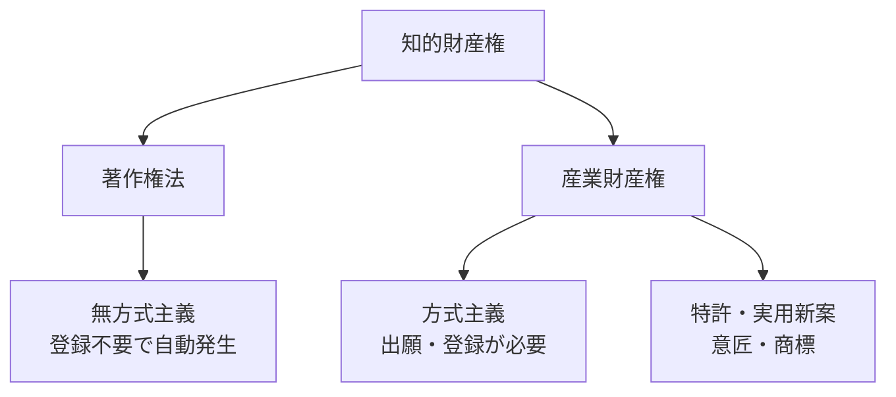
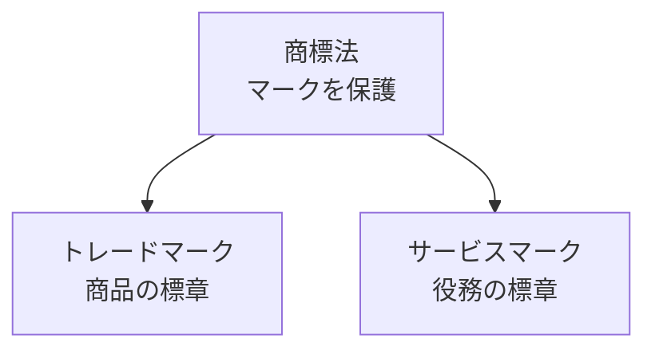
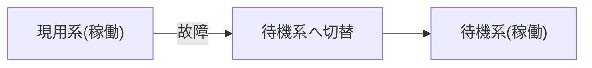
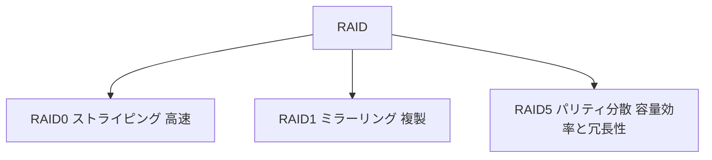

# Stage 4 Phase B — 日語正文サンプル (日語ゲート審査用)
> 代表2ユニット全文 (法務系8語 + 技術系6語)。残10 unit は units/*.json。図は data/ip/textbook/figures/*.svg。

## strategy-02-04-u01 著作権法と産業財産権の各法  [頻出 / 約23分 / 8語]
**概要**: 知的財産権の二大区分である著作権法と産業財産権(特許法・実用新案法・意匠法・商標法)が、それぞれ何を保護するのかを体系的に学ぶ単元です。権利が自動で発生するか登録が必要かという違いは試験で繰り返し問われる最重要ポイントで、以降の契約・提供形態を理解する土台にもなります。

### 著作権法
- **定義**: 思想や感情を創作的に表現した著作物を、創作と同時に自動的に保護する法律。
- **解説**: 著作権法は、文章・音楽・プログラム・イラストなど「表現されたもの(著作物)」を保護します。最大の特徴は無方式主義で、申請や登録をしなくても作品を創作した瞬間に権利が発生する点です。  
      
    これが産業財産権(特許・意匠・商標など)との決定的な違いです。産業財産権は特許庁への出願・登録が必要(方式主義)ですが、著作権は登録不要で自動発生します。試験では「登録しないと著作権は発生しない」という記述は誤り、という形でよく問われます。  
      
    なお保護されるのは「表現」であって、アイデアそのものは保護されません。プログラムは著作物に含まれますが、その背後の解法やアルゴリズムは著作権では守られない点も要注意です。
- **例え**: 日記を書いた瞬間、役所に届け出なくても「これは私が書いたもの」と言える状態。紙に表現した瞬間にあなたの権利になるイメージです。
- **記憶フック**: 著作権法といえば登録不要で自動発生(無方式主義)
- **即時チェック**: 2010h22a-q032, 2010h22h-q025
- **図解**: `figures/strategy-02-04-u01-t01.svg` rendered=true

### 特許法
- **定義**: 自然法則を利用した技術的なアイデア(発明)を、登録により保護する法律。
- **解説**: 特許法は「発明」、つまり新しくて高度な技術的アイデアを保護します。産業財産権の代表格で、特許庁へ出願し審査を経て登録されると、独占的に実施できる権利が与えられます。  
      
    保護対象が「アイデア(技術思想)」である点が重要です。著作権が「表現」を守るのに対し、特許は新しい仕組み・方法そのものを守ります。たとえば画期的な圧縮方式という「考え方」は特許の対象になり得ます。  
      
    試験では、保護期間(出願から原則20年)や、新規性・進歩性が要件であること、登録が必要(無審査ではない)ことが問われます。著作権の自動発生との対比で覚えましょう。
- **例え**: 新しい料理の「調理法そのもの」を役所に登録して、他人に勝手に真似されないよう独占権をもらうようなイメージです。
- **記憶フック**: 特許法といえば発明(技術アイデア)を登録して保護
- **即時チェック**: 2011h23a-q010, 2011h23a-q020

### ビジネスモデル特許
- **定義**: ITを活用した新しい事業の仕組みを発明として保護する特許。
- **解説**: ビジネスモデル特許は、商売のやり方(ビジネスモデル)そのものではなく、それをコンピュータやネットワークなどのITで実現した「技術的な仕組み」を特許として認めるものです。  
      
    ここがよく誤解される試験ポイントです。単なるアイデアや商法だけでは特許になりません。あくまで自然法則を利用した技術(情報処理の仕組み)と結びついて初めて特許の対象になります。  
      
    例として、オンラインの逆オークションや、ポイント還元を自動処理する仕組みなどがあります。特許法の枠内にある応用概念として、特許法の直後で押さえておきましょう。
- **例え**: 「会員証でポイントを貯める」という発想だけでは権利化できないが、それをアプリで自動計算する独自の仕組みにすると保護対象になるイメージです。
- **記憶フック**: ビジネスモデル特許といえばITで実現した事業の仕組み
- **即時チェック**: 2010h22h-q007

### 実用新案法
- **定義**: 物品の形状・構造などに関する小発明(考案)を無審査で保護する法律。
- **解説**: 実用新案法は、特許ほど高度でない技術的アイデア「考案」を保護します。対象は物品の形状・構造・組合せに限られ、方法やプログラムは対象外です。  
      
    特許との対比が最頻出ポイントです。特許は実体審査を経て登録されますが、実用新案は新規性などの実体審査をせずに登録される(無審査主義)点が大きく異なります。そのぶん権利は早く取れますが、保護期間は出願から10年と特許より短くなっています。  
      
    「小発明」「無審査」「物品の形状・構造」という三つのキーワードで、特許との違いを整理して覚えましょう。
- **例え**: 特許が厳しい審査つきの上級資格なら、実用新案は審査なしで早く取れる準資格。ただし有効期間は短め、というイメージです。
- **記憶フック**: 実用新案法といえば小発明を無審査で保護
- **即時チェック**: 2009h21h-q015, 2014h26h-q024

### 意匠法
- **定義**: 物品のデザイン(形状・模様・色彩など)を登録により保護する法律。
- **解説**: 意匠法は、製品の「見た目の美しさ・デザイン」を保護します。物品の形状・模様・色彩、またはこれらの結合で、視覚を通じて美感を起こさせるものが対象です。  
      
    保護対象が「外観・デザイン」である点で、技術アイデアを守る特許・実用新案や、表現を守る著作権とは区別されます。たとえばスマートフォンの斬新な形状や、独特のボトルデザインなどが意匠登録の対象です。  
      
    試験では「意匠=デザイン」「特許=発明」「商標=マーク」という対応関係を入れ替えた誤答が頻出します。何を守る法律かをセットで暗記しましょう。
- **例え**: 中身の機能ではなく「見た目のかっこよさ」に与えられる権利。おしゃれな椅子の独特なフォルムを真似させない、というイメージです。
- **記憶フック**: 意匠法といえば物品のデザイン(見た目)を保護
- **即時チェック**: 2010h22a-q012, 2013h25a-q023

### 商標法
- **定義**: 商品やサービスを識別するマーク(商標)を登録により保護する法律。
- **解説**: 商標法は、事業者が自社の商品・サービスを他社と区別するために使う「マーク(文字・図形・記号など)」を保護します。ブランド名やロゴが典型例です。  
      
    他の産業財産権との違いは、守る対象が技術やデザインではなく「信用・識別力」である点です。長く使うほど価値が高まるため、登録は更新によって半永久的に維持できます(他の権利は期間満了で消滅)。これは試験でよく狙われる特徴です。  
      
    また商標には、商品に付ける「トレードマーク」と、サービスに付ける「サービスマーク」という下位概念があります。次の二語とあわせて体系で理解しましょう。
- **例え**: お店の「のれん」や有名ブランドのロゴのように、「これはあの会社の品だ」と一目で分かる目印を独占できる権利です。
- **記憶フック**: 商標法といえばマーク(ブランド・ロゴ)を保護し更新で半永久
- **即時チェック**: 2012h24h-q029, 2013h25h-q011
- **図解**: `figures/strategy-02-04-u01-t02.svg` rendered=true

### トレードマーク
- **定義**: 商品に付けて他社製品と区別するための商標(マーク)。
- **解説**: トレードマークは、商標のうち「商品」に使われるマークを指します。たとえば飲料の銘柄ロゴや、お菓子のブランドマークなどが該当します。  
      
    ポイントは、保護されるのが形のある「商品」に付く標識である点です。次に学ぶサービスマーク(役務に付くマーク)と対になる概念で、両者を合わせて商標を構成します。  
      
    試験では商標法の具体例として、トレードマーク=商品、サービスマーク=サービス、という対応を問われます。商標法とセットで、どちらに付くマークかを混同しないようにしましょう。
- **例え**: ペットボトルや箱など「モノ」に貼られているブランドの目印。手に取れる商品側のマーク、と覚えるとよいです。
- **記憶フック**: トレードマークといえば商品に付けるマーク
- **即時チェック**: 2009h21a-q021

### サービスマーク
- **定義**: サービス(役務)に付けて他社と区別するための商標(マーク)。
- **解説**: サービスマークは、商標のうち「サービス(役務)」に使われるマークを指します。運送・金融・飲食・通信などの形のないサービスを提供する事業者のブランドマークが該当します。  
      
    トレードマークが「商品」に付くのに対し、サービスマークは「サービス」に付くという対比が核心です。どちらも商標法で保護される商標であり、提供するものが有形か無形かで呼び分けます。  
      
    試験では二つのマークの区別が狙われます。トレード=商品(モノ)、サービス=役務(サービス)、と対で覚えると確実です。
- **例え**: 宅配便や銀行のロゴのように、「モノ」ではなく「サービス」を表す目印。手に取れないサービス側のマーク、と覚えましょう。
- **記憶フック**: サービスマークといえば役務(サービス)に付けるマーク
- **即時チェック**: 2025r07-q012

**まとめ — 記憶フック一覧**:
- 著作権法: 著作権法といえば登録不要で自動発生(無方式主義)
- 特許法: 特許法といえば発明(技術アイデア)を登録して保護
- ビジネスモデル特許: ビジネスモデル特許といえばITで実現した事業の仕組み
- 実用新案法: 実用新案法といえば小発明を無審査で保護
- 意匠法: 意匠法といえば物品のデザイン(見た目)を保護
- 商標法: 商標法といえばマーク(ブランド・ロゴ)を保護し更新で半永久
- トレードマーク: トレードマークといえば商品に付けるマーク
- サービスマーク: サービスマークといえば役務(サービス)に付けるマーク

**要点**:
- 知的財産権は大きく「著作権法」と「産業財産権(特許・実用新案・意匠・商標)」に分かれる。
- 著作権は無方式主義で創作と同時に自動発生するが、産業財産権は出願・登録が必要(方式主義)。最頻出の対比点。
- 各法が守る対象は、特許=発明(技術アイデア)、実用新案=小発明(物品の形状・構造、無審査)、意匠=デザイン、商標=マーク。
- 商標権は更新により半永久的に維持できる点が他の権利と異なる。
- 商標には商品に付ける「トレードマーク」とサービスに付ける「サービスマーク」がある。

**チャレンジ問題**: 2011h23a-q004, 2012h24a-q009, 2014h26a-q006, 2015h27h-q021, 2011h23tokubetsu-q001

---

## technology-16-43-u02 可用性と信頼性のためのシステム構成  [標準 / 約18分 / 6語]
**概要**: 本ユニットでは、複数の機器やディスクを組み合わせてシステムを止めず、データを失わないための冗長化構成を学ぶ。デュアル・デュプレックス・クラスタといった機器の二重化から、レプリケーション・RAID・NAS というデータ面の信頼性確保までを扱う。可用性と信頼性は試験で頻出のテーマで、特に各方式の違い(同時稼働か待機か等)が問われる。

### デュアルシステム
- **定義**: 2系統を同時に稼働させ、結果を相互照合して信頼性を高める冗長構成。
- **解説**: デュアルシステムは、まったく同じ処理を2つの系統で同時に実行し、両者の結果を突き合わせて誤りがないか確認する方式です。常に2系統が動いているため、片方が故障してももう片方で処理を続けられ、信頼性が非常に高くなります。  
      
    試験では「待機系を持つデュプレックスシステム」との違いがよく問われます。デュアルは『両方とも本番稼働＋結果照合』、デュプレックスは『片方は待機』という点が決定的な区別です。コストは高いが高信頼が求められる銀行のオンライン処理などに使われます。
- **例え**: 重要な計算を2人が別々に解き、答えが一致するか毎回突き合わせるようなもの。1人がミスしても、もう1人の答えで気づける。
- **記憶フック**: デュアルシステムといえば2系統同時稼働で結果照合
- **即時チェック**: 2016h28h-q075

### デュプレックスシステム
- **定義**: 現用系が稼働し、もう一方を待機系として備える二重化構成。
- **解説**: デュプレックスシステムは、片方を現用系(本番)として動かし、もう片方を待機系として備えておく方式です。現用系が故障したら待機系に切り替えて処理を継続します。待機系の備え方には、起動・同期させておき即座に切り替えられるホットスタンバイ、待機系を停止しておき故障時に起動してから切り替える(切替に時間がかかる)コールドスタンバイなどがあります。  
      
    試験では名前が似たデュアルシステムとの対比が定番です。デュプレックスは『片方が待機』なので無駄が少なくコストを抑えられる一方、切り替えに時間がかかる場合があります。同時稼働で照合するデュアルとの違いを押さえましょう。
- **例え**: 野球の先発投手と控え投手のような関係。普段は先発が投げ、調子が悪くなったら控えが登板して試合を続ける。
- **記憶フック**: デュプレックスシステムといえば現用系＋待機系で切り替え
- **即時チェック**: 2017h29a-q087
- **図解**: `figures/technology-16-43-u02-t01.svg` rendered=true

### クラスタ
- **定義**: 複数のコンピュータを連携させ1つのシステムに見せる構成。
- **解説**: クラスタは、複数台のコンピュータをネットワークでまとめ、利用者からは1つのシステムのように見せる構成です。目的は大きく2つで、1台が故障しても他の台で処理を引き継ぐ『可用性向上(HAクラスタ)』と、処理を分担して性能を上げる『負荷分散・高性能化』があります。  
      
    試験では、二重化(デュアル・デュプレックス)の発展形として複数台を束ねる点が問われます。台数を増やせばさらに止まりにくく・速くできる、というスケールしやすさがクラスタの特徴です。
- **例え**: 1人では運べない荷物を複数人で分担して運ぶチーム。誰かが抜けても他のメンバーで仕事を続けられる。
- **記憶フック**: クラスタといえば複数台を束ねて1つに見せる
- **即時チェック**: 2009h21h-q073

### レプリケーション
- **定義**: データを別の場所に複製し、同じ内容を保持する仕組み。
- **解説**: レプリケーションは、あるデータを別のサーバやディスクへ複製(コピー)し、同じ内容を持たせ続ける技術です。元のデータが壊れたり、サーバが止まったりしても、複製先のデータで処理を続けられるため、信頼性と可用性が高まります。  
      
    機器の二重化が『装置』を複製するのに対し、レプリケーションは『データ』を複製する点が試験での着目点です。バックアップが過去の一時点を保存するのに対し、レプリケーションは更新を反映して常に最新を保つ点も区別して覚えましょう。
- **例え**: 大事な書類を作るたびに、同じものをもう1部すぐ別の引き出しにも入れておくようなもの。片方を失っても困らない。
- **記憶フック**: レプリケーションといえばデータを複製して同じ内容を保持
- **即時チェック**: 2013h25h-q073

### RAID
- **定義**: 複数のディスクを束ね、冗長化や高速化を図るストレージ技術。
- **解説**: RAID(Redundant Arrays of Independent Disks)は、複数のハードディスクを1つにまとめて、データを分散・複製して保存する技術です。1台が壊れても他のディスクからデータを復元できる『冗長化』や、読み書きを分担する『高速化』を実現します。本ユニットで最頻出の用語なので、確実に押さえましょう。  
      
    試験では代表的な方式の違いが問われます。RAID0は分散書き込み(ストライピング)で高速だが冗長性なし、RAID1は同じデータを2台に書く複製(ミラーリング)で安全、RAID5はパリティ(誤り訂正符号)を分散させ容量効率と冗長性を両立します。RAID0は信頼性向上ではない点に注意。
- **例え**: 同じ資料を複数のキャビネットに分けて保管する仕組み。1つが燃えても他から復元でき、分担すれば出し入れも速い。
- **記憶フック**: RAIDといえば複数ディスクで冗長化・高速化
- **即時チェック**: 2009h21a-q078, 2011h23a-q082
- **図解**: `figures/technology-16-43-u02-t02.svg` rendered=true

### NAS
- **定義**: ネットワークに直接接続し、複数機器でファイルを共有する記憶装置。
- **解説**: NAS(Network Attached Storage)は、ネットワークに直接つながる専用のファイルサーバ型ストレージです。LAN上の複数のパソコンやサーバから、同じファイルを共有してアクセスできます。内部にRAIDを備える製品が多く、データの信頼性も確保できます。  
      
    試験では『ネットワーク経由でファイル単位で共有する』点が特徴として問われます。各PCに直接つなぐ外付けディスク(DAS)と違い、NASは1台を皆で共有できるため、データの一元管理やバックアップがしやすくなります。
- **例え**: オフィスの共用書庫のようなもの。誰でもネットワーク越しに同じ棚へアクセスでき、資料を皆で出し入れできる。
- **記憶フック**: NASといえばネットワーク接続でファイル共有するストレージ
- **即時チェック**: 2012h24h-q074

**まとめ — 記憶フック一覧**:
- デュアルシステム: デュアルシステムといえば2系統同時稼働で結果照合
- デュプレックスシステム: デュプレックスシステムといえば現用系＋待機系で切り替え
- クラスタ: クラスタといえば複数台を束ねて1つに見せる
- レプリケーション: レプリケーションといえばデータを複製して同じ内容を保持
- RAID: RAIDといえば複数ディスクで冗長化・高速化
- NAS: NASといえばネットワーク接続でファイル共有するストレージ

**要点**:
- 冗長化は『機器の二重化』と『データの複製』の2系統で理解する。デュアル/デュプレックス/クラスタは機器、レプリケーション/RAID/NASはデータ・ストレージ面の信頼性確保。
- デュアル(2系統同時稼働＋結果照合)とデュプレックス(現用系＋待機系で切替)の違いは最頻出の対比ポイント。
- RAIDは本ユニット最頻出。RAID0(高速・冗長なし)/RAID1(ミラーリング)/RAID5(パリティ分散)の特徴を区別する。
- クラスタは二重化の発展形で、複数台を束ねて可用性向上と負荷分散の両方に使える。
- NASはネットワーク接続でファイルを共有するストレージで、内部にRAIDを持つことが多い。

**チャレンジ問題**: 2012h24a-q055, 2013h25a-q059, 2017h29h-q078, 2023r05-q070, 2018h30h-q077

---
